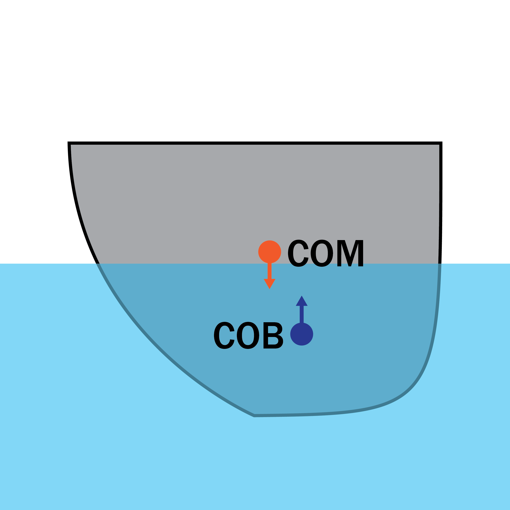
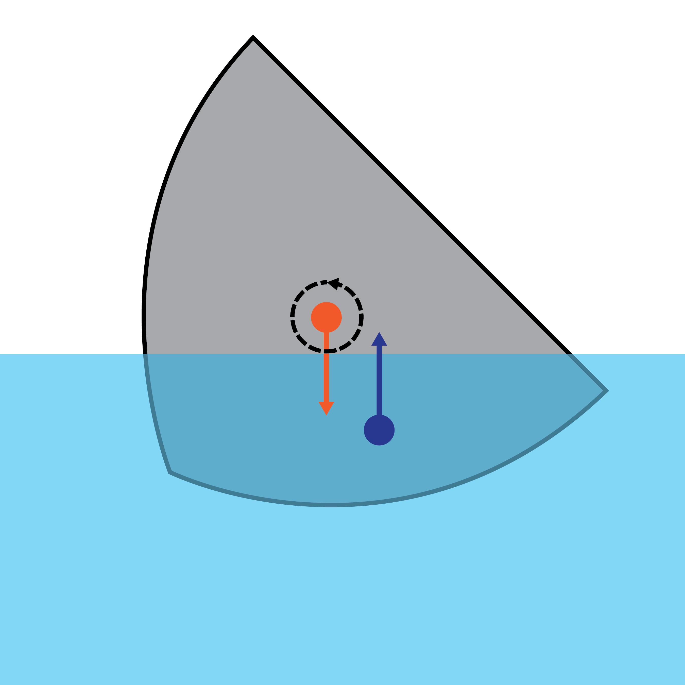
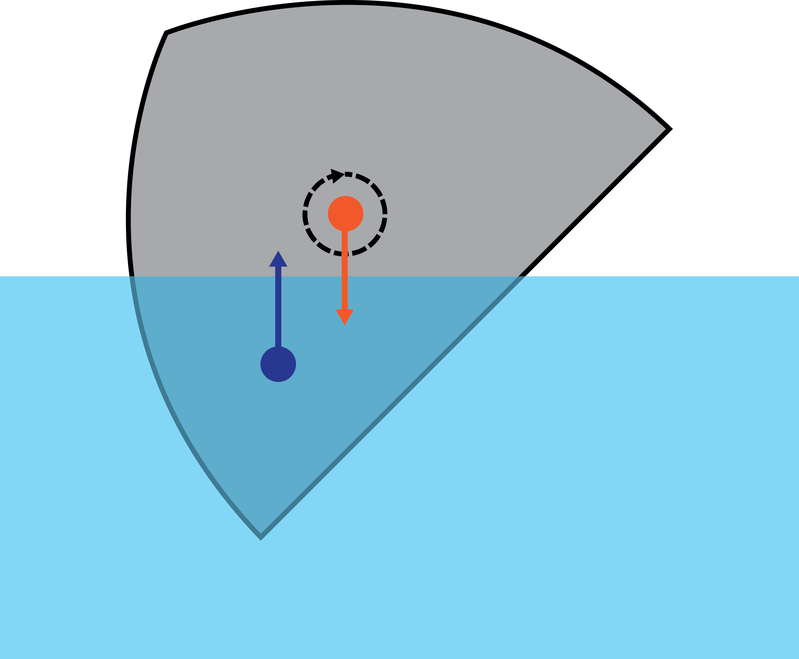
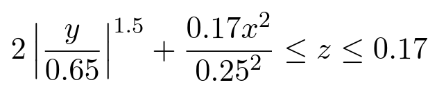
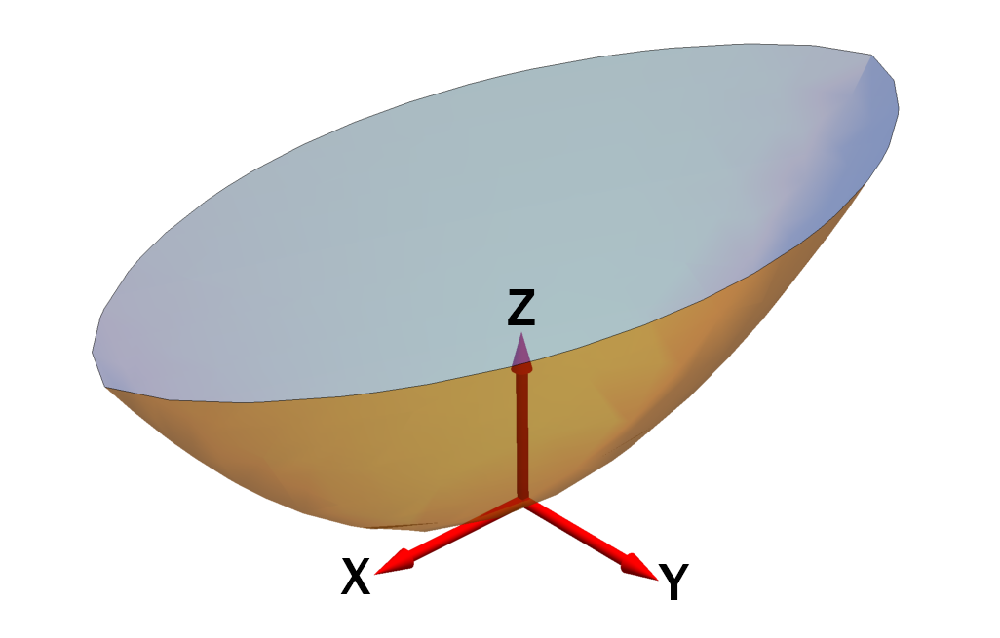
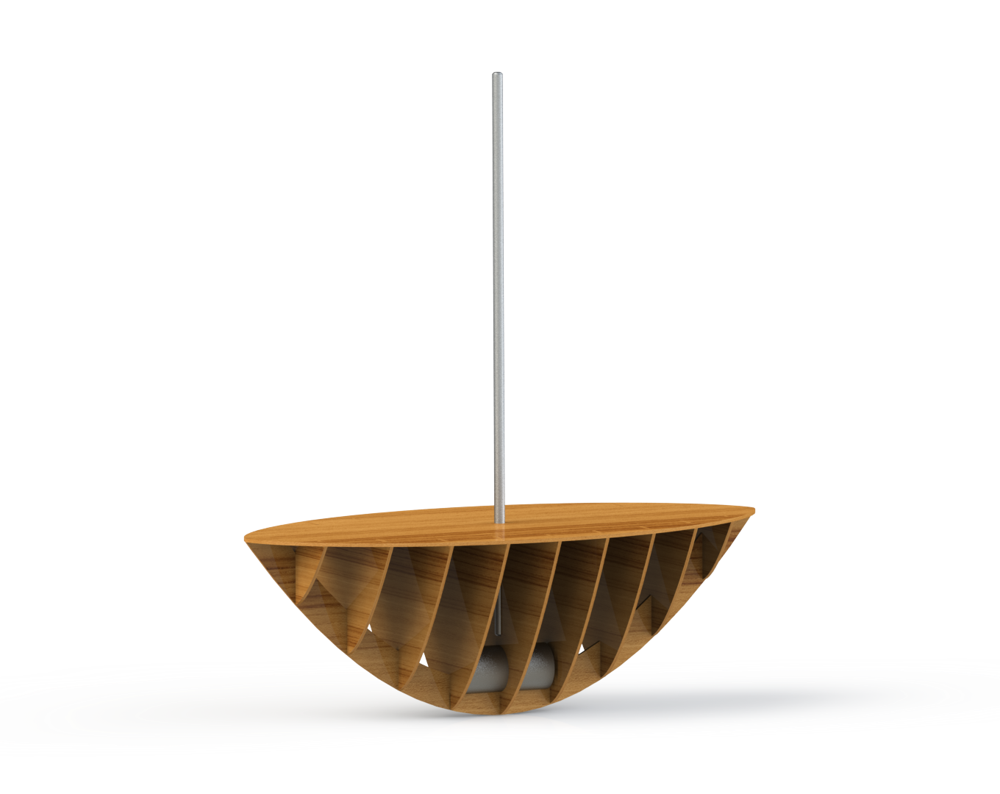
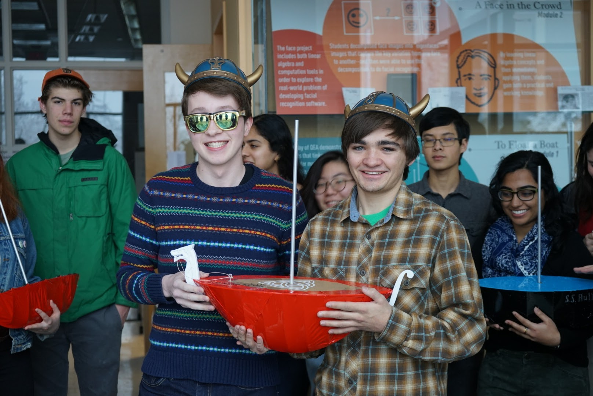

For our first project, we were tasked with designing a boat. It had to fulfill certain requirements: it had to float on water, float flat, have an [angle of vanishing stability](http://sailskills.co.uk/Stability/sailskills_stability_stability_explained_AVS.html) of between 120° and 140°, and go as fast as possible. And what's more, we couldn't test it - we had to design it mathematically, fabricate it, and be confident that our calculations were correct. We managed to accomplish it in under a week.

## Boat Calculations

The first step in our design process was to determine a mathematical function we could use to define the hull of our boat. There were a number of factors we had to take into consideration; the most important ones were center of mass (COM) and center of buoyancy (COB), the COM of the submerged volume of the boat. The locations of these two points were critical to our boat design, as they dictate essentially all of the most important behaviors of the boat.

  

  

    
      
    
  

  

    
      
    
  

As can be seen above, the shape of the hull determines where the COM and COB lie; a symmetrical hull has both points vertically aligned, but an asymmetrical hull doesn't. When the two points aren't aligned vertically, a *righting moment* is created which causes the boat to rotate.

  

    
      
    
  

  

    
      
    
  

However, also important to the design of the boat is how the COM and COB move when the boat tilts. The above figures illustrate how the direction of the righting moment changes based on the positions of the COM and COB; the point where the righting moment shifts from rotating the boat upright to capsizing it is the angle of vanishing stability (AVS). We can calculate the AVS for a given hull by determining the positions of the COM and COB for a variety of angles.

## Our Design

With these factors in mind, we created a mathematical definition for our boat's hull:

In our boat design, the coordinate system is as follows:

We arrived at this design by beginning with a basic 2D hull design given in class and converting it to a 3D solid by adding additional terms to the equation. After defining the basic shape, we tweaked the parameters using trial and error until we arrived at a design that gave us a desirable AVS - our calculated AVS was 130°, right in the center of the desired AVS range.

## Boat Construction

After mathematically defining our boat, we had to fabricate it. First, we created a full CAD design of the boat to ensure that everything could fit together; additionally, we had to include a ballast and a mast in our boat, so we included those in our CAD design as well.

We then laser cut the frame of our boat and spent several days gluing everything together with the ballast and mast.

After gluing everything together, we wrapped it in vinyl shrink wrap to waterproof it. We also had enough time to add some aesthetic elements, such as a sail and a 3D-printed figurehead. We named it... The Intégrätør.

## Boat performance

On the testing day, our boat performed admirably. It fulfilled all the requirements, with a perfect AVS of 130° and a relatively high max speed of 4.31 m/s. It was slightly unstable due to a low righting moment at low angles, a factor we overlooked when designing the boat. However, it still worked well enough to float flat, and its intimidating size made it a force to be reckoned with. You can view our full boat design report [here](assets/QEA_Boat_Paper.pdf).

