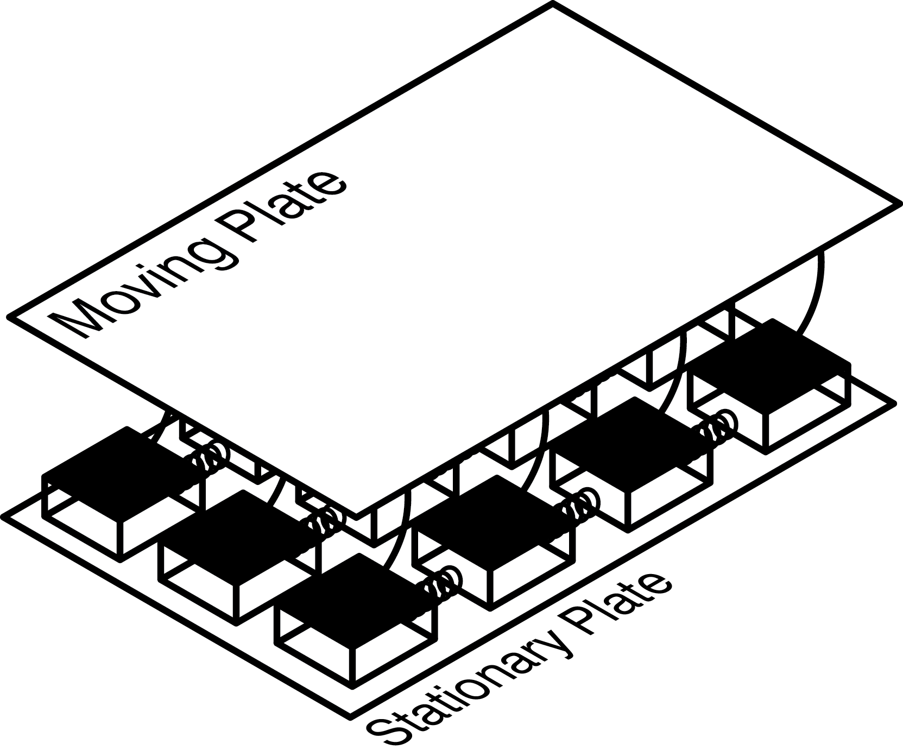
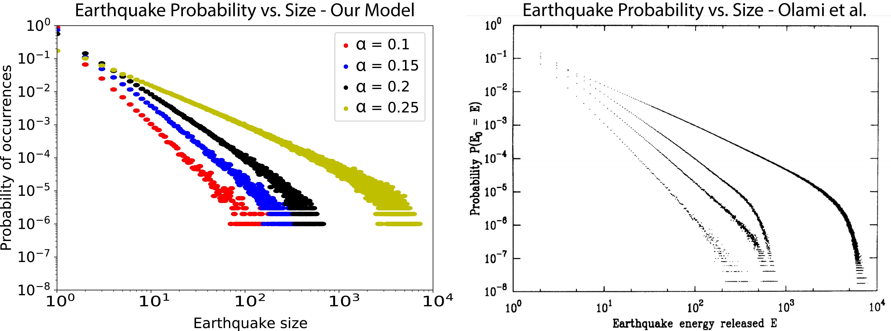

In this project, my team aimed to investigate the [self-organized criticality](https://en.wikipedia.org/wiki/Self-organized_criticality) (SOC) of earthquakes by replicating a [paper](http://basin.earth.ncu.edu.tw/Course/SeminarII/abstract2013_1/0306-2-1.pdf) that models earthquakes using a cellular-automata based model; using this model, we investigated whether the system exhibits common SOC properties: power-law distributions, pink noise, and fractal geometry. We found that it isn't always easy to draw a clear line as to whether a system is self-organized critical; however, this model of earthquakes did display some features of SOC, even when energy wasn't conserved within the system.

## Building an Earthquake Model

One known properties of earthquakes in the physical world is that their occurrence follows a standard distribution;  the frequency of occurrence of an earthquake decreases with the size of the earthquake, following a [power-law distribution](https://en.wikipedia.org/wiki/Power_law). Power-law distributions are also a property of SOC systems, and thus it follows that a potential explanation for this property of earthquakes is that they are an SOC system. However, at the time of the paper's publishing, it was thought that energy conservation was required for a system to be SOC; we set out to show that it's possible even when energy isn't conserved.

Our model, based on the model in the paper, is a stick-and-slip model of earthquakes; a fault line is represented by a 2D grid of blocks. Each block is resting on a stationary plate and attached via springs to both its neighbors and a moving plate above. While this model isn't how earthquakes function in the physical world, it exhibits properties similar to real earthquakes, and thus is useful for studying properties of earthquakes in the physical world.

In this model, initial forces are randomly distributed among the blocks, and each block has a threshold force; when the total force on a block from its neighbors exceeds the threshold force, the block slips, distributing the forces in it to its neighbors. Most of the time, only one block slips at a time, in a small earthquake; however, occasionally a single slipping block can cause a chain reaction, leading its neighbors to slip, and so on, constituting a much larger earthquake.

## Cellular Automaton Implementation

We implemented our model in Python using a basic cellular automaton framework. The grid of blocks is represented by a 2D matrix, where value of each element in the matrix is the total force on that particular block. Each timestep, the total force is computed on each block, and those blocks that exceed the threshold force are set to 0 with their forces redistributed to their neighbors.

Our program uses the [ThinkComplexity](https://github.com/allendowney/thinkcomplexity2) library, utilizing [Numpy](http://www.numpy.org/) for the matrix-based calculations. In our graphical representation of the system, white squares have zero net force acting on them, while red and blue blocks indicate positive and negative forces, respectively. As can be seen in our visualization, most of the time, only a few blocks slip in any given timestep; however, occasionally, larger earthquakes do occur when one block triggers a chain reaction.

As can be seen in the figure above, we were able to closely replicate some of the results of the original paper; a straight line on a log-log scale indicates that our system follows a power-law distribution, and our quantitative results were almost exactly the same as the results of the original paper.

## Quake visualization

In addition to the replication of the original paper, one aspect of the project that I worked on was creating visualizations of the earthquake model. Using [matplotlib](https://matplotlib.org/), I created a 3D visualization of the earthquakes; although it doesn't show much quantitative information, it gives a good comparison of the difference between high-force and low-force blocks.

## Learn more

You can find the full writeup of our project and results, as well as all of our code, on our [Github repo](https://github.com/mpbrucker/ComplexityProject2).
