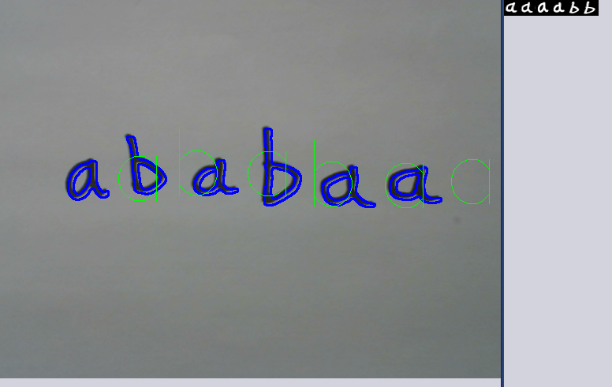

For my work in the Olin Robotics Lab, I worked with the Edwin group (a group that focuses on eusocial, coworking robots) to create experiences that emphasize human-robot interaction. For my project, I created a simple game: write your name in your normal handwriting, and Edwin will guess it and reproduce it. This project heavily involved image processing and character recognition techniques.

## Preprocessing

The first step in recognizing is to perform preprocessing in order to isolate characters. I achieved this by using a number of [OpenCV](https://opencv.org/) filters to isolate the contours of the individual characters and convert them into black-and-white images similar in look to the famous [MNIST](http://yann.lecun.com/exdb/mnist/) dataset.

  

    
      
    
  

After isolating the characters, I then sorted the contours by their x-position on-screen in order to arrange them into word order - I also detected large gaps between characters in order to find the spaces. Then, letters are guessed based on the letter contours.

## Determining Letters

In order to determine what letters are written, I used a simple k-nearest neighbor algorithm to categorize the training dataset. Originally, I used the MNIST dataset to categorize numbers; however, because I was in need of a letter dataset in addition to a number dataset, I eventually opted to create my own dataset. This dataset consists of approximately 100 of each letter, written in Sharpie by several and preprocessed in the same method my program uses for detection. I was able to achieve a reasonable amount of accuracy using just this dataset.

## Writing the Words

In order to write the words, my program interfaced with a number of other scripts written by the Edwin group, with everything controlled by [ROS](http://www.ros.org/). In fact, the only functionality my program has is to input the camera feed, and output the string of whatever word is being guessed. I did use a threshold of "stability," where the same word had to appear for three seconds in order to guarantee that it was actually seeing a word; additionally, I added detection of whenever a new word is seen. Through this, we implemented a simple program where Edwin (the robot) looks at a word written on a piece of paper, and then writes down his own guess of what word was written, seen below.

  

    
      
    
  

