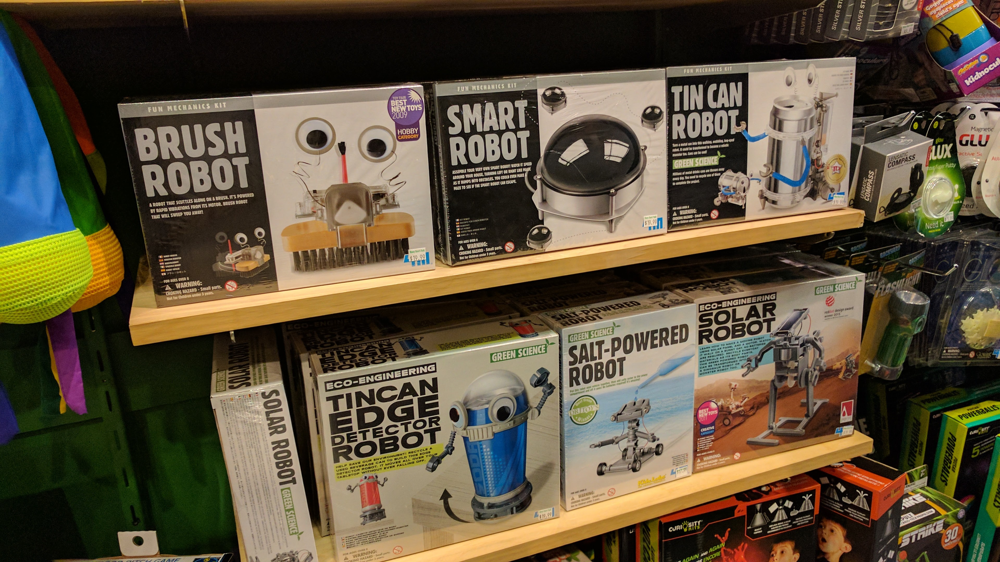
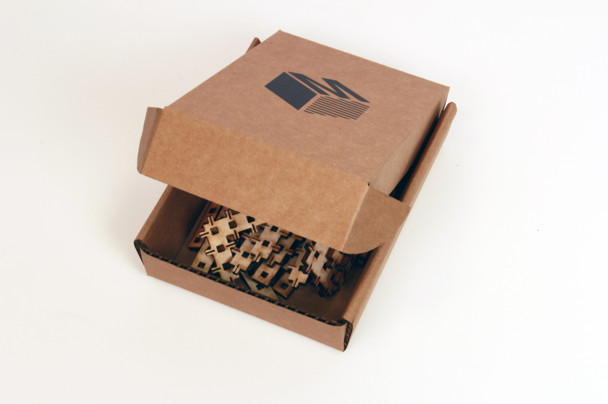
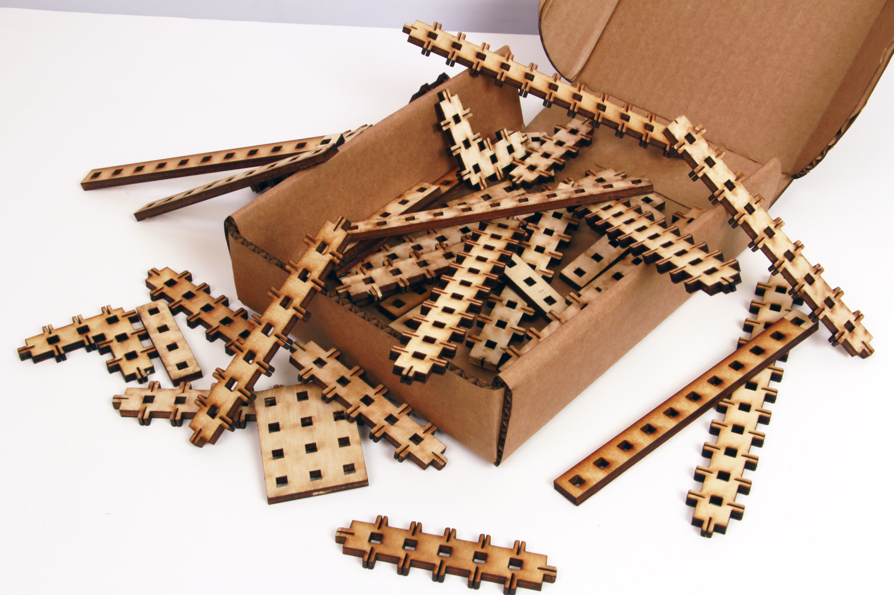
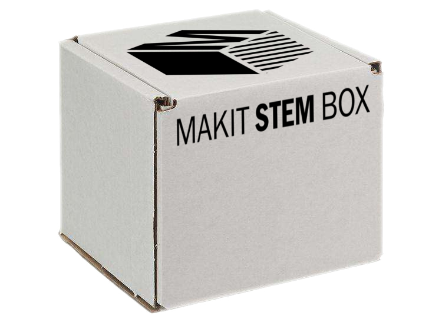
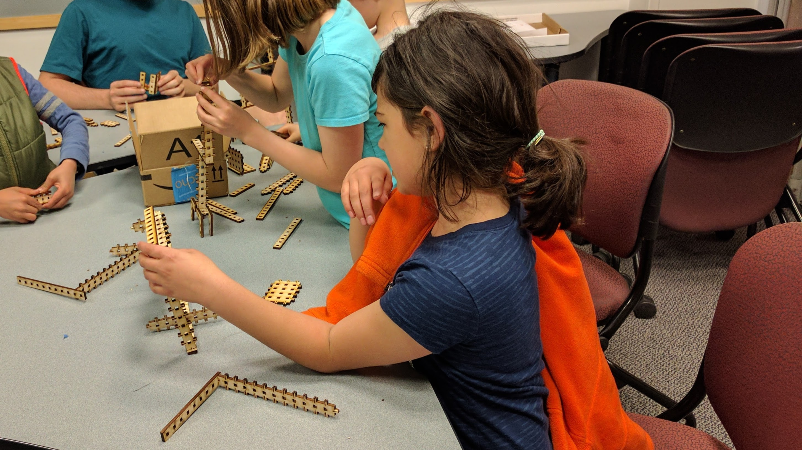
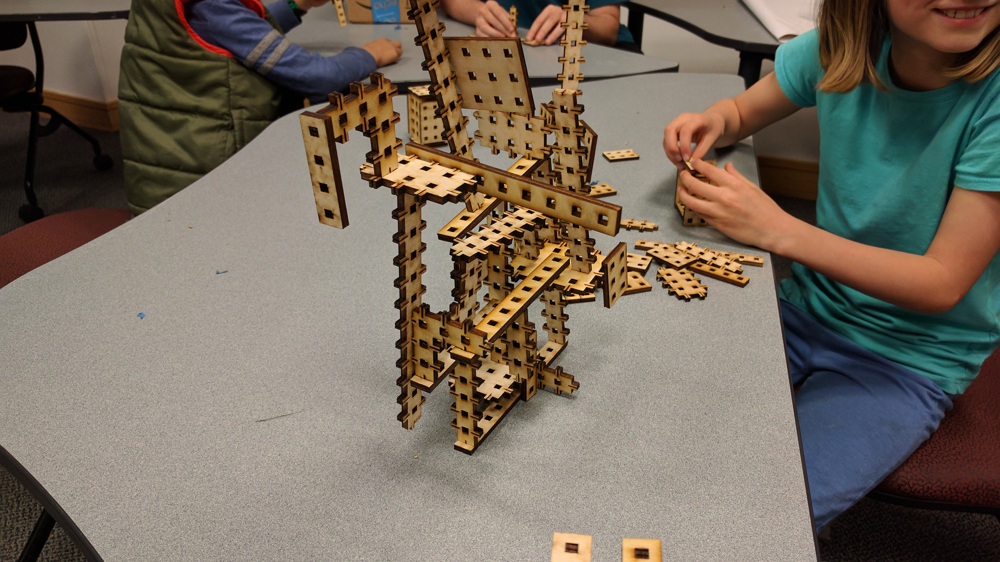

For this project, my team investigated creating a subscription service that sells monthly subscriptions to educational toys. We went through several iterations of our idea, testing different types of toys, different models of sale, and eventually creating and playtesting our own construction toy set.

## Research

The first phase of our project was focused on investigating what our target segment was, and whether our idea was viable with that particular segment. We set out with a target segment of parents of elementary-school children; initially, our value proposition was a monthly subscription service of structured toys. Each month would center around a particular concept and project, and would include all of the supplies needed, as well as the instructions, to build that project. With this idea in mind, we started by researching existing products, particularly focusing on science-based toys.

  

    
      
    
  

  

    
      
    
  

From our initial research talking to toy store employees, we found that science kits were not what most parents were looking for; they were often purchased as gifts, and they were returned more frequently than other toys. However, another type of toy was both high-selling and had many return customers: construction kits. Because we were testing the viability of a subscription service, we wanted to produce toys that would generate repeat customers. So, we pivoted to a much more open-ended, construction kit toy design.

## Toy Fabrication

The next step in our process was to actually make a basic version of a kit and test its viability. We prototyped a number of different modular construction kit toy ideas, fabricating them out of laser-cut plywood to allow for rapid prototyping of our ideas.

  

    
      
    
  

  

    
      
    
  

## Testing

Then, we assembled the pieces into a box, and began testing. We set up a website to gauge interest in the product, and to determine whether anyone on the Internet would actually be interested in buying our service.

  

    
      
    
  

  

    
      
    
  

Additionally, we conducted an in-person playtest to see what actual elementary-school students would think of our toys.

  

    
      
    
  

  

    
      
    
  

Our main concern when playtesting was engagement; could we keep our testers engaged for a long period, leaving them wanting to play more? Fortunately, on that front, we succeeded: our playtesters were engaged for the full hour of the playtest. However, we did find room for improvement; we brainstormed new piece ideas with the playtesters, and we also found issues with the durability of the construction. Ultimately, we learned a lot from our testing; our playtest was a success, and we were able to actually generate interest in our kits from our website!
