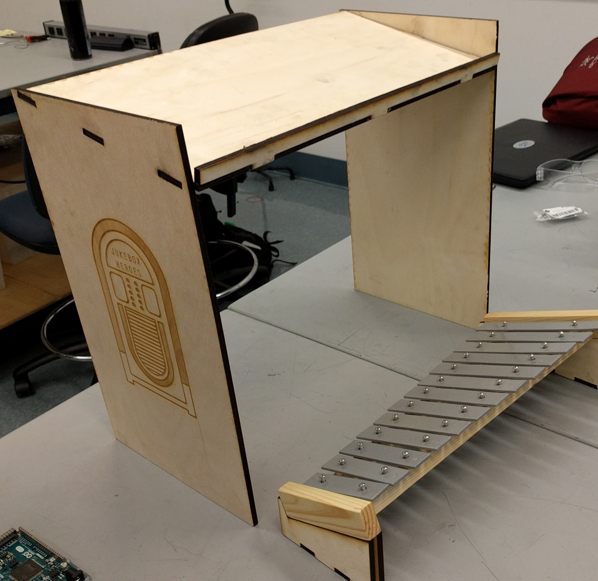
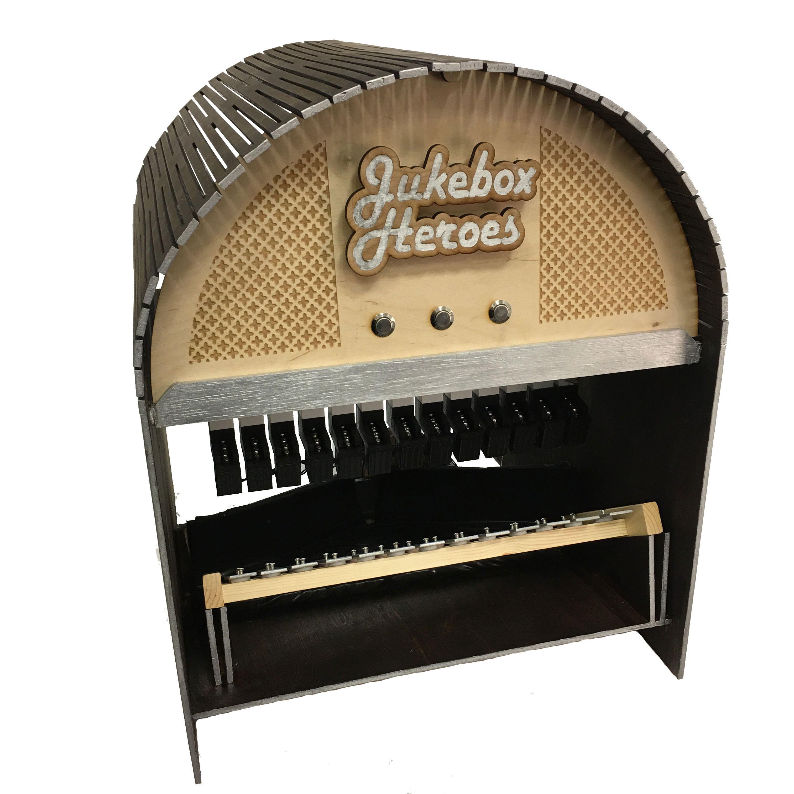
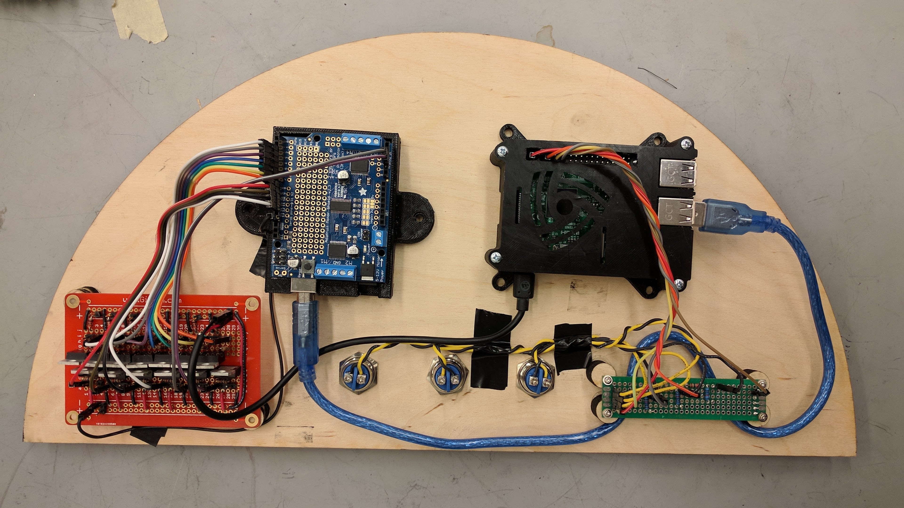

In Principles of Engineering, my team was given eight weeks to create a project that combined mechanical, electrical, and software elements. We set out to create a mechanical jukebox: a device that, given a user input, would play a song by dropping marbles onto a xylophone in time with the notes of the song. Over the course of the project, we went through a rapid series of prototypes to take our project from a prototype...

  

    
      
    
  

...To the finished product.

  

    
      
    
  

## Jukebox Software

On this project, my main role was to write the software to control the jukebox. I started out by writing simple Arduino code to play notes; we chose to use an Arduino to control the electronics in order to have a precise enough timing to play notes accurately. The actual note actuation is handled by a row of 13 mini solenoids, each of which is individually controlled via the digital output pins of the Arduino. The first revision of Arduino code simply took in a serial input and output notes at the correct times based on the input. I chose to make the serial command a single string of bytes, as it simplifies song playing since the Arduino can have an entire song input at once.

  

    
      
    
  

The next step in writing the jukebox code was to allow for more complex processing of songs. In addition to reformatting how the serial data is processed by the Arduino in order to fix issues with notes playing concurrently, I also began writing C++ code that ran on a Raspberry Pi. This code would process MIDI files stored on the RasPi in order to format a serial message to send to the Arduino.

### Creating the Final System

  

    
      
    
  

Our ultimate goal in our project was to make a jukebox that could run on its own, with simple user input. To achieve this, I had to add several improvements to the jukebox code. First, I added button input - via the RasPi's GPIO pins - to select songs. I also modified the C++ code so that it could choose from multiple songs using the buttons, and I added the C++ code to startup on the RasPi so that it would run when the RasPi was turned on. Ultimately, we ended up with a jukebox that works from the start - you simply plug it in, and it works. Writing the jukebox code was an extremely useful exercise in writing code that was consistent and reliable; we didn't want to have to do a lot of problem-fixing in order to make the jukebox function for extended periods of time.

  

    
      <iframe width="560" height="315" src="https://www.youtube.com/embed/a6WiX90mLuc" frameborder="0" gesture="media" allow="encrypted-media" allowfullscreen></iframe>
    
  

## Check it Out

To view our full project documentation, see our [project website.](http://poe.olin.edu/2017/mechajukebox/)
