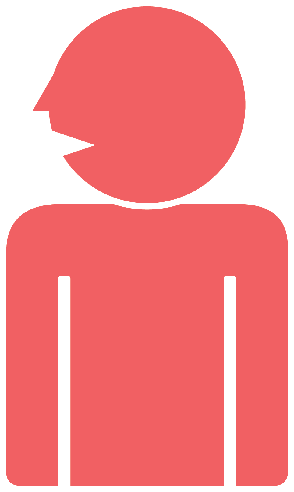
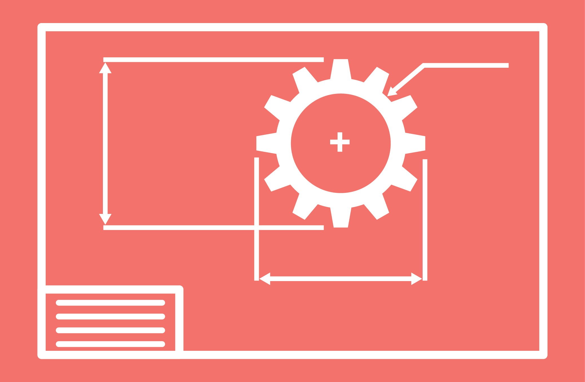
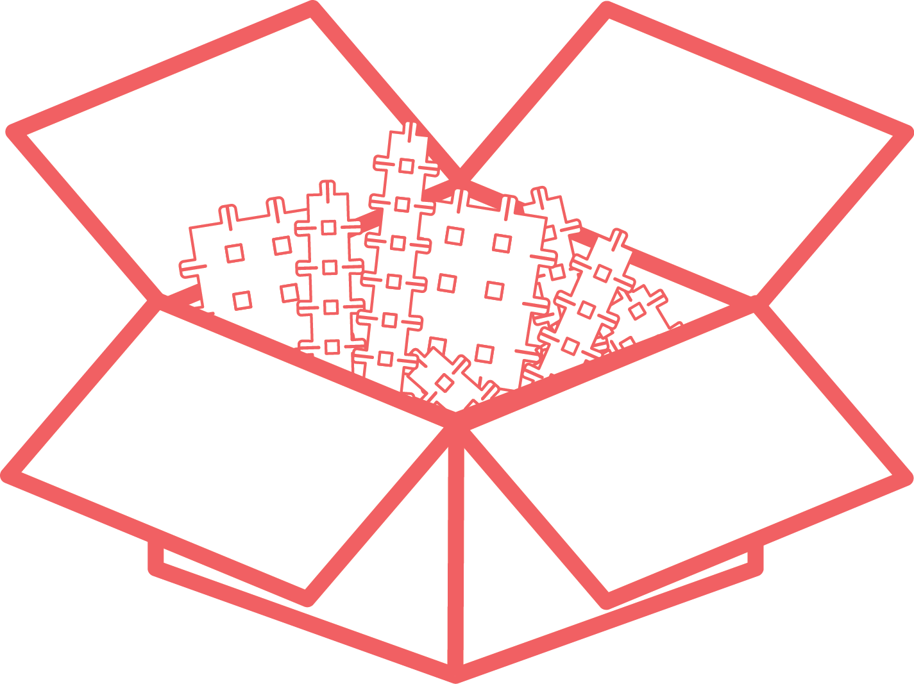
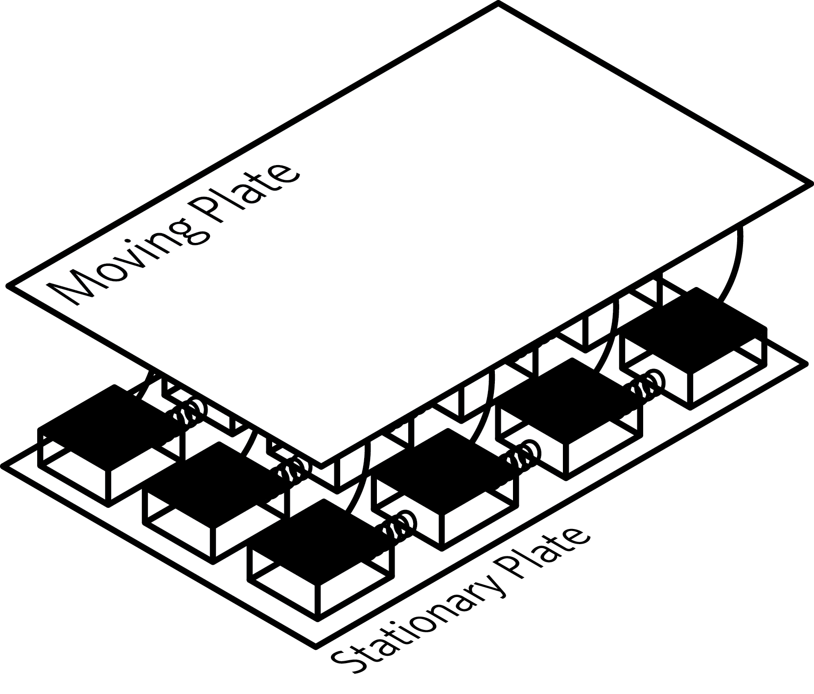
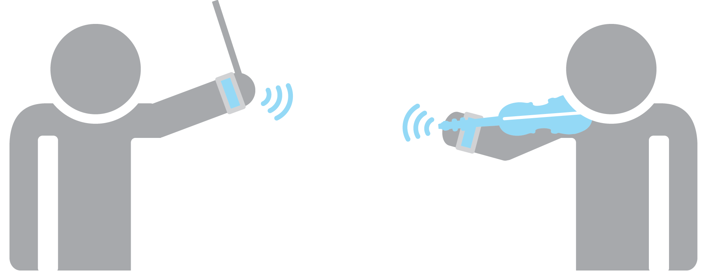
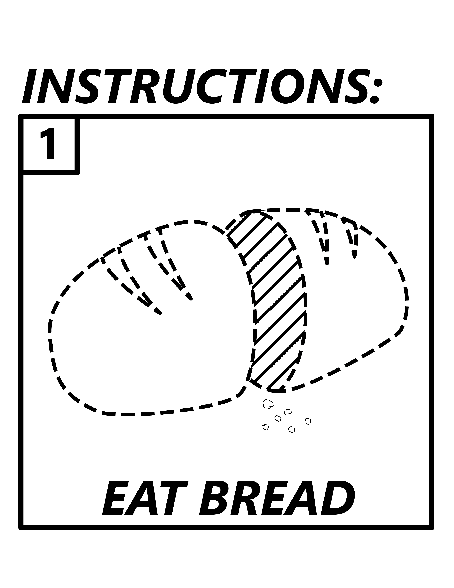
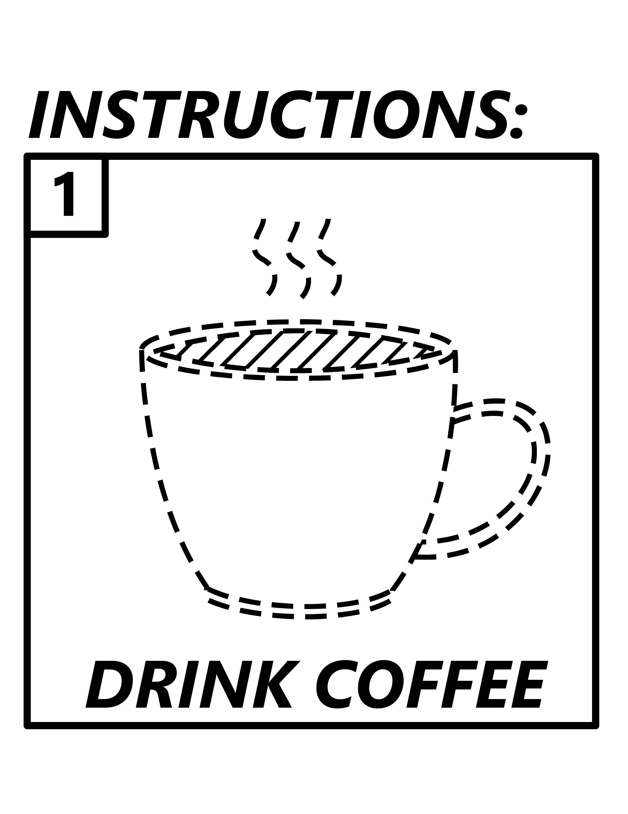
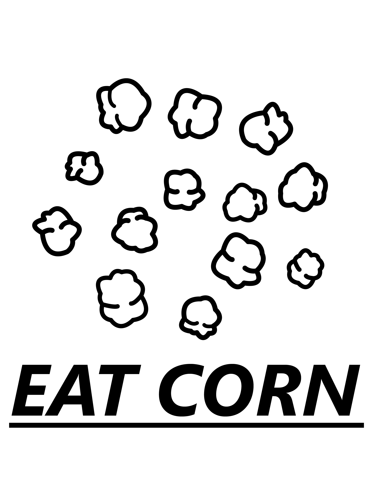
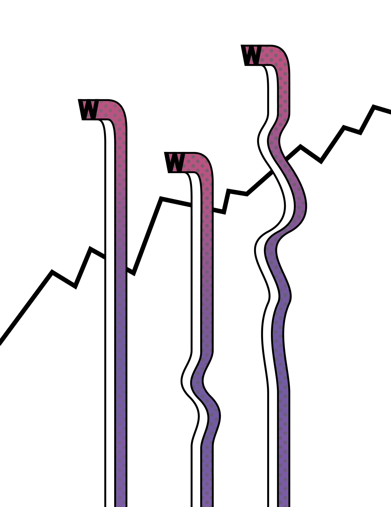
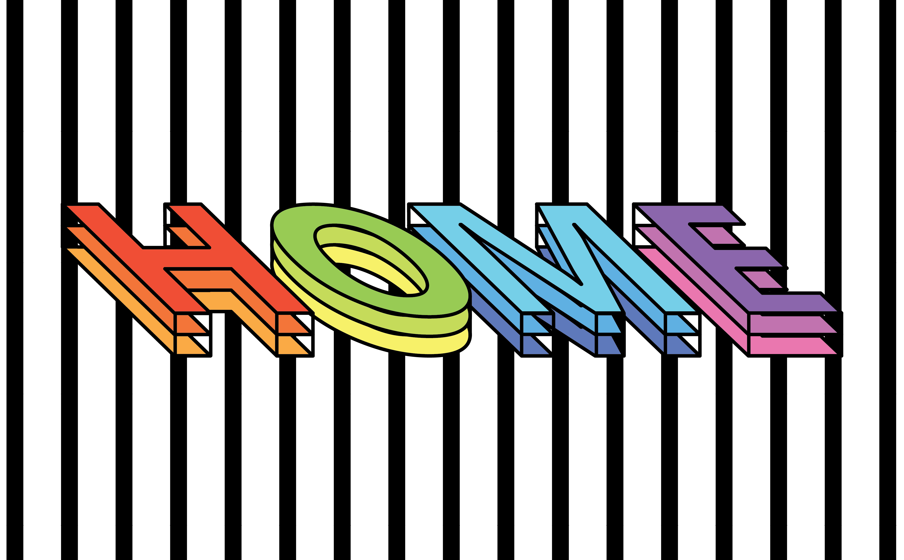

## Iconography

These icons and logos were designed for use in various class-related projects.

  

    
      
    
  

  

    
      
    
  

  

    
      
    
  

  

    
      
    
  

  

    
      
    
  

  

    
      
    
  

  

    
      
    
  

## Posters/Other Graphics

The rest of my work has been focused on things I've made for fun or for personal use.

  

    
      
    
  

  

    
      
    
  

  

    
      
    
  

  

    
      
    
  

  

    
      
    
  

  

    
      
    
  

  

    
      
    
  

